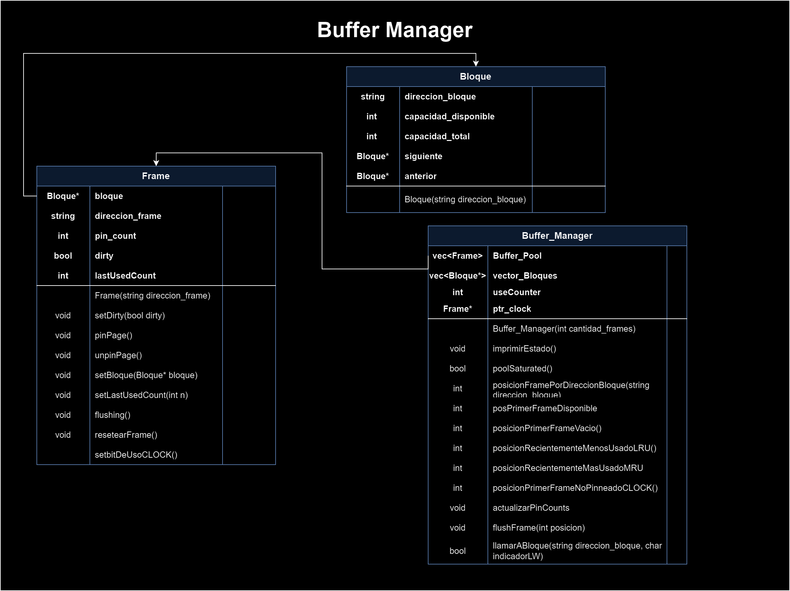
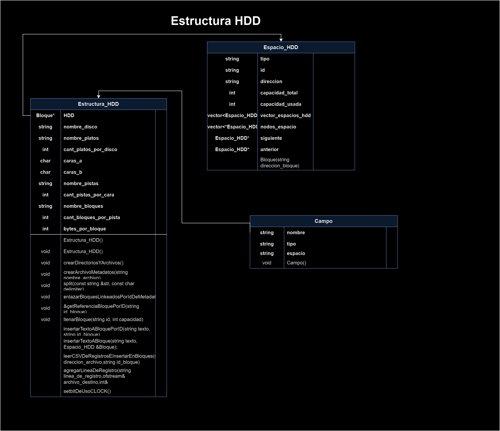
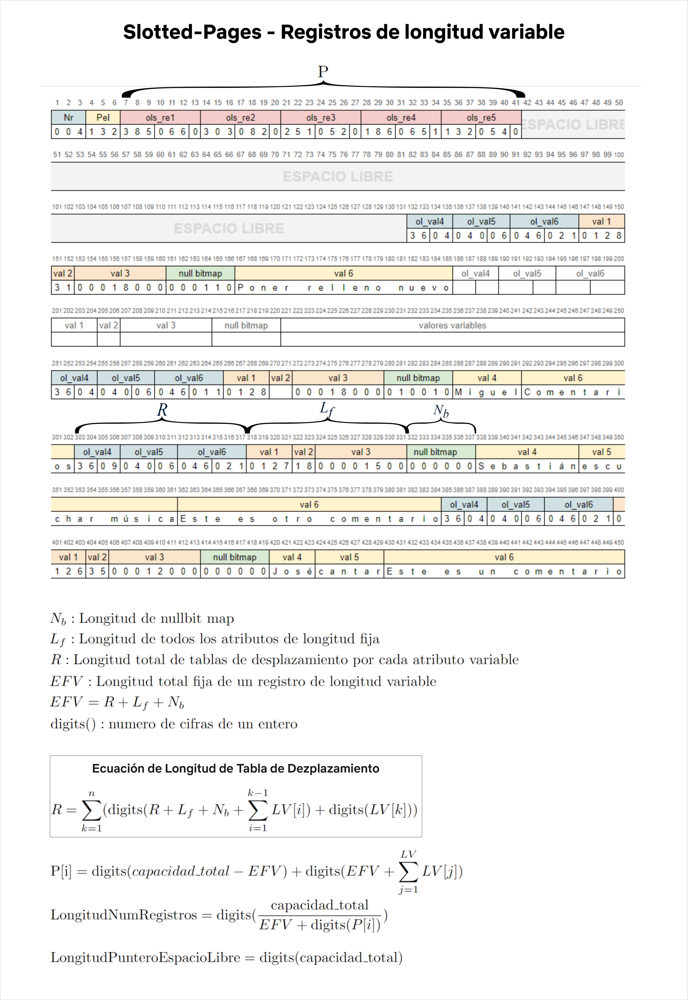

## **Diagramas**

- **Buffer Manager**



- **Estructura HDD**



- **Estructura de Manejo HDD**


## **Teoría a considerar**

### Tipos de Datos y tamanios de ccampo:

1. **Tipos de Datos Numéricos**:
   - **INT**: Generalmente ocupa 4 bytes. - CONSIDERADO
   - **SMALLINT**: Generalmente ocupa 2 bytes.
   - **BIGINT**: Generalmente ocupa 8 bytes.
   - **FLOAT**: Generalmente ocupa 4 bytes.
   - **DOUBLE**: Generalmente ocupa 8 bytes.
   - **DECIMAL**: El tamaño depende de la precisión y escala especificadas.

2. **Tipos de Datos de Cadena**:
   - **CHAR(n)**: Ocupa n bytes, donde n es el número de caracteres especificados. 
   - **VARCHAR(n)**: Ocupa el tamaño real de la cadena más 1 o 2 bytes adicionales para almacenar la longitud de la cadena. - CONSIDERADO
   - **TEXT**: El tamaño puede variar ampliamente y depende de la implementación de la base de datos.

3. **Tipos de Datos de Fecha y Hora**:
   - **DATE**: Generalmente ocupa 3 bytes.
   - **TIME**: Generalmente ocupa 3 bytes.
   - **DATETIME**: Generalmente ocupa 8 bytes.
   - **TIMESTAMP**: Generalmente ocupa 4 bytes.

4. **Tipos de Datos Binarios**:
   - **BLOB**: El tamaño puede variar ampliamente y depende de la implementación de la base de datos.

#### Definición de Campos con Diferentes Tipos de Datos:

```sql
CREATE TABLE ejemplo (
    id INT,                 -- 4 bytes
    nombre VARCHAR(255),    -- Longitud de la cadena + 1 o 2 bytes
    edad SMALLINT,          -- 2 bytes
    salario DECIMAL(10, 2), -- Dependiendo de la implementación
    fecha_nacimiento DATE,  -- 3 bytes
    foto BLOB               -- Tamaño variable
);
```

### Relación entre espacio y caracteres

- **ASCII:** caracter = 1 byte (8 bits) - CONSIDERADO
- **Unicode y UTF-8:** caracter = entre 1 y 4 bytes
- **UTF-16:** caracter = entre 2 y 4 bytes
- **UTF-32:** caracter = 4 bytes

## **Importante**

- Para la creacion de carpetas y archivos: incluir la biblioteca <windows.h> para utilizar la función CreateDirectory() en Windows. Además, tener en cuenta que este código solo funcionará en sistemas Windows. Si estás trabajando en un entorno POSIX como Linux o macOS, deberás utilizar la función mkdir() como se mostró originalmente.

## **Registros de longitud variable**




## **Políticas de Reemplazo**

### **Proceso de Evaluación LRU y MRU en un Buffer Pool**

#### 1. Identificación de Frames Pinneados:

- **Frames Pinneados:** Son aquellos que están actualmente en uso por alguna transacción y, por lo tanto, no se pueden reemplazar.
- **Acción:** Se descartan estos frames de la evaluación LRU.

#### 2. Identificación de Frames Dirty:

- **Frames Dirty:** Son aquellos que han sido modificados pero aún no han sido escritos de vuelta al disco.
- **Acción:** Se descartan temporalmente de la evaluación de *políticia de reemplazo*, ya que escribir en disco puede ser costoso en términos de tiempo.

#### 3-A .Evaluación LRU:

- **Proceso:** Entre los frames restantes (ni pinneados ni dirty), se aplica la política LRU para identificar cuál de ellos ha sido menos utilizado recientemente.
- **Acción:** El frame seleccionado es reemplazado con la nueva página que se requiere cargar en el buffer pool.

#### 3-B .Evaluación MRU:

- **Proceso:** Entre los frames restantes (ni pinneados ni dirty), se aplica la política MRU para identificar cuál de ellos ha sido utilizado recientemente.
- **Acción:** El frame seleccionado es reemplazado con la nueva página que se requiere cargar en el buffer pool.


### **Casos Especiales**

#### Todos los Frames están Pinneados:

- **Acción:** Las solicitudes al buffer pool se bloquean y se espera a que alguno de los frames se libere (unpinned).

#### Todos los Frames están Pinneados o Dirty:

- **Acción:** Se aplica el proceso de LRU entre los frames dirty.
- **Proceso de Flushing:** El frame dirty seleccionado por LRU se escribe en disco (flushing).
- **Reemplazo:** Una vez que el frame dirty ha sido escrito en disco, se puede reemplazar con la nueva página.

#### LRU - Todos los Frames están Pinneados o Dirty excepto el más reciente:
- **Acción:** Se aplica el proceso de LRU entre los frames dirty.
