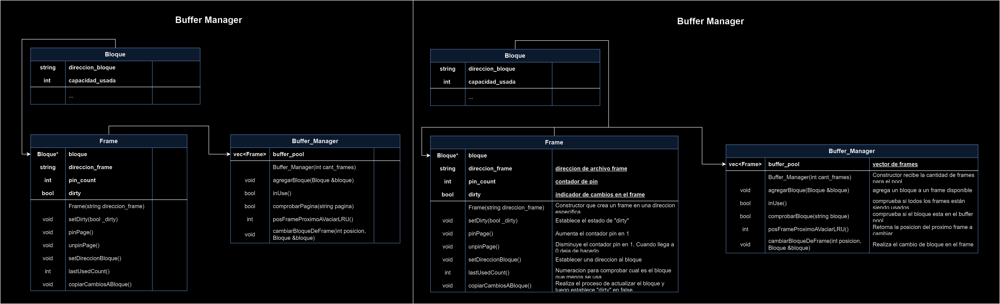
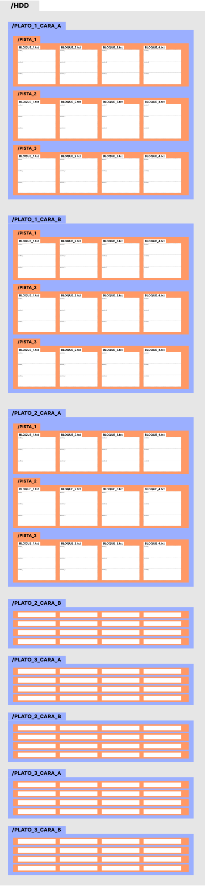

## Diagramas

- Bufferf

- Estructura de Manejo HDD

- HDD

## Importante

- Para la creacion de carpetas y archivos: incluir la biblioteca <windows.h> para utilizar la función CreateDirectory() en Windows. Además, tener en cuenta que este código solo funcionará en sistemas Windows. Si estás trabajando en un entorno POSIX como Linux o macOS, deberás utilizar la función mkdir() como se mostró originalmente.

